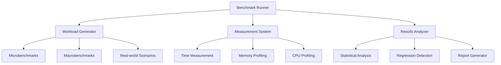

# Advanced Benchmarking Framework for Cap'n Proto Rust

## Overview

This document outlines the design for a comprehensive benchmarking framework to validate performance optimizations, detect regressions, and guide future improvements.

## Framework Architecture

### Core Components



## Benchmark Categories

### 1. Microbenchmarks
**Purpose:** Measure individual component performance
**Examples:**
- Segment allocation/deallocation
- Primitive list access
- Serialization/deserialization of single messages
- Pointer traversal

### 2. Macrobenchmarks
**Purpose:** Measure end-to-end system performance
**Examples:**
- Batch message processing
- RPC request/response cycles
- Streaming scenarios
- Complex object graph traversal

### 3. Real-world Scenarios
**Purpose:** Validate performance with realistic workloads
**Examples:**
- Address book processing
- Catrank benchmark
- Eval benchmark
- Custom user scenarios

## Framework Implementation

### Core Benchmark Trait

```rust
pub trait Benchmark: Send + Sync {
    /// Name of the benchmark
    fn name(&self) -> &str;
    
    /// Description of what's being measured
    fn description(&self) -> &str;
    
    /// Category of benchmark
    fn category(&self) -> BenchmarkCategory;
    
    /// Setup before running benchmark
    fn setup(&mut self) -> Result<()>;
    
    /// Run the actual benchmark
    fn run(&mut self) -> Result<()>;
    
    /// Teardown after running benchmark
    fn teardown(&mut self) -> Result<()>;
    
    /// Verify benchmark results
    fn verify(&self) -> Result<()>;
}

#[derive(Debug, Clone, Copy, PartialEq, Eq)]
pub enum BenchmarkCategory {
    Micro,
    Macro,
    RealWorld,
    Stress,
    Regression,
}
```

### Benchmark Runner

```rust
pub struct BenchmarkRunner {
    benchmarks: Vec<Box<dyn Benchmark>>,
    config: BenchmarkConfig,
    results: Vec<BenchmarkResult>,
}

impl BenchmarkRunner {
    pub fn new() -> Self {
        Self {
            benchmarks: Vec::new(),
            config: BenchmarkConfig::default(),
            results: Vec::new(),
        }
    }
    
    pub fn add_benchmark(&mut self, benchmark: impl Benchmark + 'static) {
        self.benchmarks.push(Box::new(benchmark));
    }
    
    pub fn run_all(&mut self) -> Result<()> {
        for benchmark in &mut self.benchmarks {
            self.run_benchmark(benchmark)?;
        }
        Ok(())
    }
    
    fn run_benchmark(&mut self, benchmark: &mut Box<dyn Benchmark>) -> Result<()> {
        // Setup
        benchmark.setup()?;
        
        // Warmup
        if self.config.warmup_iterations > 0 {
            self.run_warmup(benchmark)?;
        }
        
        // Actual benchmark
        let measurements = self.run_measurements(benchmark)?;
        
        // Teardown
        benchmark.teardown()?;
        
        // Verify
        benchmark.verify()?;
        
        // Store results
        let result = BenchmarkResult {
            name: benchmark.name().to_string(),
            description: benchmark.description().to_string(),
            category: benchmark.category(),
            measurements,
            timestamp: SystemTime::now(),
        };
        
        self.results.push(result);
        
        Ok(())
    }
}
```

### Measurement System

```rust
pub struct MeasurementSystem {
    time_measurements: Vec<Duration>,
    memory_measurements: Vec<MemoryUsage>,
    cpu_measurements: Vec<CpuUsage>,
    start_time: Instant,
    start_memory: Option<MemoryUsage>,
    start_cpu: Option<CpuUsage>,
}

impl MeasurementSystem {
    pub fn new() -> Self {
        Self {
            time_measurements: Vec::new(),
            memory_measurements: Vec::new(),
            cpu_measurements: Vec::new(),
            start_time: Instant::now(),
            start_memory: None,
            start_cpu: None,
        }
    }
    
    pub fn start_measurement(&mut self) {
        self.start_time = Instant::now();
        self.start_memory = Some(self.current_memory_usage());
        self.start_cpu = Some(self.current_cpu_usage());
    }
    
    pub fn end_measurement(&mut self) {
        let elapsed = self.start_time.elapsed();
        let memory = self.current_memory_usage();
        let cpu = self.current_cpu_usage();
        
        self.time_measurements.push(elapsed);
        
        if let Some(start_memory) = self.start_memory {
            self.memory_measurements.push(memory - start_memory);
        }
        
        if let Some(start_cpu) = self.start_cpu {
            self.cpu_measurements.push(cpu - start_cpu);
        }
    }
    
    fn current_memory_usage(&self) -> MemoryUsage {
        // Platform-specific memory measurement
        #[cfg(unix)]
        {
            // Use procfs or similar
            MemoryUsage::from_system()
        }
        
        #[cfg(not(unix))]
        {
            MemoryUsage::default()
        }
    }
    
    fn current_cpu_usage(&self) -> CpuUsage {
        // Platform-specific CPU measurement
        #[cfg(unix)]
        {
            // Use procfs or similar
            CpuUsage::from_system()
        }
        
        #[cfg(not(unix))]
        {
            CpuUsage::default()
        }
    }
}

pub struct MemoryUsage {
    pub resident: usize,
    pub virtual_: usize,
    pub heap: usize,
}

pub struct CpuUsage {
    pub user: f64,
    pub system: f64,
    pub total: f64,
}
```

## Benchmark Configuration

```rust
#[derive(Debug, Clone)]
pub struct BenchmarkConfig {
    /// Number of iterations to run
    pub iterations: usize,
    
    /// Number of warmup iterations
    pub warmup_iterations: usize,
    
    /// Target duration for each benchmark
    pub target_duration: Duration,
    
    /// Whether to collect memory metrics
    pub collect_memory: bool,
    
    /// Whether to collect CPU metrics
    pub collect_cpu: bool,
    
    /// Output format
    pub output_format: OutputFormat,
    
    /// Comparison baseline (for regression detection)
    pub baseline: Option<PathBuf>,
    
    /// Statistical confidence level
    pub confidence_level: f64,
}

#[derive(Debug, Clone, Copy, PartialEq, Eq)]
pub enum OutputFormat {
    Text,
    Json,
    Csv,
    Markdown,
}

impl Default for BenchmarkConfig {
    fn default() -> Self {
        Self {
            iterations: 100,
            warmup_iterations: 10,
            target_duration: Duration::from_secs(1),
            collect_memory: true,
            collect_cpu: false,
            output_format: OutputFormat::Text,
            baseline: None,
            confidence_level: 0.95,
        }
    }
}
```

## Benchmark Results

```rust
#[derive(Debug, Clone, Serialize, Deserialize)]
pub struct BenchmarkResult {
    pub name: String,
    pub description: String,
    pub category: BenchmarkCategory,
    pub measurements: Vec<Measurement>,
    pub timestamp: SystemTime,
}

#[derive(Debug, Clone, Serialize, Deserialize)]
pub struct Measurement {
    pub duration: Duration,
    pub memory: Option<MemoryUsage>,
    pub cpu: Option<CpuUsage>,
    pub iteration: usize,
}

impl BenchmarkResult {
    pub fn calculate_statistics(&self) -> BenchmarkStatistics {
        let durations: Vec<f64> = self.measurements
            .iter()
            .map(|m| m.duration.as_secs_f64())
            .collect();
        
        BenchmarkStatistics {
            name: self.name.clone(),
            min: durations.iter().copied().fold(f64::INFINITY, f64::min),
            max: durations.iter().copied().fold(f64::NEG_INFINITY, f64::max),
            mean: Self::mean(&durations),
            median: Self::median(&durations),
            std_dev: Self::std_dev(&durations),
            throughput: Self::calculate_throughput(&self.measurements),
            memory_efficiency: Self::calculate_memory_efficiency(&self.measurements),
        }
    }
    
    fn mean(data: &[f64]) -> f64 {
        data.iter().sum::<f64>() / data.len() as f64
    }
    
    fn median(data: &[f64]) -> f64 {
        let mut sorted = data.to_vec();
        sorted.sort_by(|a, b| a.partial_cmp(b).unwrap());
        let mid = sorted.len() / 2;
        if sorted.len() % 2 == 0 {
            (sorted[mid - 1] + sorted[mid]) / 2.0
        } else {
            sorted[mid]
        }
    }
    
    fn std_dev(data: &[f64]) -> f64 {
        let mean = Self::mean(data);
        let variance = data.iter()
            .map(|x| (x - mean).powi(2))
            .sum::<f64>() / data.len() as f64;
        variance.sqrt()
    }
}

#[derive(Debug, Clone, Serialize, Deserialize)]
pub struct BenchmarkStatistics {
    pub name: String,
    pub min: f64,
    pub max: f64,
    pub mean: f64,
    pub median: f64,
    pub std_dev: f64,
    pub throughput: f64, // operations per second
    pub memory_efficiency: f64, // bytes per operation
}
```

## Regression Detection

```rust
pub struct RegressionDetector {
    baseline_results: HashMap<String, BenchmarkStatistics>,
    current_results: HashMap<String, BenchmarkStatistics>,
    config: RegressionConfig,
}

impl RegressionDetector {
    pub fn new(baseline: HashMap<String, BenchmarkStatistics>) -> Self {
        Self {
            baseline_results: baseline,
            current_results: HashMap::new(),
            config: RegressionConfig::default(),
        }
    }
    
    pub fn add_current_result(&mut self, name: String, stats: BenchmarkStatistics) {
        self.current_results.insert(name, stats);
    }
    
    pub fn detect_regressions(&self) -> Vec<Regression> {
        let mut regressions = Vec::new();
        
        for (name, current) in &self.current_results {
            if let Some(baseline) = self.baseline_results.get(name) {
                if self.is_regression(baseline, current) {
                    regressions.push(Regression {
                        name: name.clone(),
                        baseline: baseline.clone(),
                        current: current.clone(),
                        severity: self.calculate_severity(baseline, current),
                    });
                }
            }
        }
        
        regressions
    }
    
    fn is_regression(&self, baseline: &BenchmarkStatistics, current: &BenchmarkStatistics) -> bool {
        // Check if current performance is significantly worse than baseline
        let performance_ratio = current.mean / baseline.mean;
        
        // Calculate statistical significance
        let baseline_std = baseline.std_dev;
        let current_std = current.std_dev;
        let combined_std = (baseline_std.powi(2) + current_std.powi(2)).sqrt();
        let t_score = (current.mean - baseline.mean).abs() / combined_std;
        
        // Consider it a regression if performance is worse and statistically significant
        performance_ratio > self.config.regression_threshold &&
        t_score > self.config.significance_threshold
    }
    
    fn calculate_severity(&self, baseline: &BenchmarkStatistics, current: &BenchmarkStatistics) -> RegressionSeverity {
        let performance_ratio = current.mean / baseline.mean;
        
        if performance_ratio < 1.1 {
            RegressionSeverity::Minor
        } else if performance_ratio < 1.5 {
            RegressionSeverity::Moderate
        } else if performance_ratio < 2.0 {
            RegressionSeverity::Major
        } else {
            RegressionSeverity::Critical
        }
    }
}

#[derive(Debug, Clone, Copy, PartialEq, Eq, PartialOrd, Ord)]
pub enum RegressionSeverity {
    Minor,
    Moderate,
    Major,
    Critical,
}

#[derive(Debug, Clone)]
pub struct Regression {
    pub name: String,
    pub baseline: BenchmarkStatistics,
    pub current: BenchmarkStatistics,
    pub severity: RegressionSeverity,
}

#[derive(Debug, Clone)]
pub struct RegressionConfig {
    pub regression_threshold: f64,
    pub significance_threshold: f64,
    pub min_samples: usize,
}

impl Default for RegressionConfig {
    fn default() -> Self {
        Self {
            regression_threshold: 1.05, // 5% slower is considered regression
            significance_threshold: 1.96, // 95% confidence
            min_samples: 10,
        }
    }
}
```

## Example Benchmarks

### 1. Message Serialization Benchmark

```rust
pub struct SerializationBenchmark {
    message_size: usize,
    iterations: usize,
    messages: Vec<Vec<u8>>,
}

impl SerializationBenchmark {
    pub fn new(message_size: usize) -> Self {
        Self {
            message_size,
            iterations: 0,
            messages: Vec::new(),
        }
    }
}

impl Benchmark for SerializationBenchmark {
    fn name(&self) -> &str {
        &format!("serialization_{}", self.message_size)
    }
    
    fn description(&self) -> &str {
        "Measures message serialization performance"
    }
    
    fn category(&self) -> BenchmarkCategory {
        BenchmarkCategory::Micro
    }
    
    fn setup(&mut self) -> Result<()> {
        // Create test messages
        for _ in 0..self.iterations {
            let mut message = Builder::new(HeapAllocator::new());
            let root = message.init_root::<capnp::data::Builder>();
            
            // Fill with test data
            if root.len() > 0 {
                let data = vec![0u8; self.message_size.min(root.len() as usize)];
                root[..data.len()].copy_from_slice(&data);
            }
            
            let mut buffer = Vec::new();
            capnp::serialize::write_message(&mut buffer, &message)?;
            self.messages.push(buffer);
        }
        
        Ok(())
    }
    
    fn run(&mut self) -> Result<()> {
        let mut measurement = MeasurementSystem::new();
        
        for (i, message) in self.messages.iter().enumerate() {
            measurement.start_measurement();
            
            // Deserialize and re-serialize
            let mut slice = &message[..];
            let reader = capnp::serialize::read_message_from_flat_slice(&mut slice, Default::default())?;
            
            let mut new_message = Builder::new(HeapAllocator::new());
            // Copy data from reader to new message
            // ... implementation ...
            
            let mut new_buffer = Vec::new();
            capnp::serialize::write_message(&mut new_buffer, &new_message)?;
            
            measurement.end_measurement();
            
            // Store the iteration result
            if let Some(measurement) = measurement.get_last() {
                // Store or process measurement
            }
        }
        
        Ok(())
    }
    
    fn teardown(&mut self) -> Result<()> {
        self.messages.clear();
        Ok(())
    }
    
    fn verify(&self) -> Result<()> {
        // Verify that all operations completed successfully
        Ok(())
    }
}
```

### 2. Memory Allocation Benchmark

```rust
pub struct AllocationBenchmark {
    allocator_type: AllocatorType,
    segment_sizes: Vec<u32>,
    allocations: Vec<(*mut u8, u32)>, // (ptr, size)
}

pub enum AllocatorType {
    Heap,
    Pooled,
    PerformanceOptimized,
}

impl AllocationBenchmark {
    pub fn new(allocator_type: AllocatorType, segment_sizes: Vec<u32>) -> Self {
        Self {
            allocator_type,
            segment_sizes,
            allocations: Vec::new(),
        }
    }
}

impl Benchmark for AllocationBenchmark {
    fn name(&self) -> &str {
        match self.allocator_type {
            AllocatorType::Heap => "allocation_heap",
            AllocatorType::Pooled => "allocation_pooled",
            AllocatorType::PerformanceOptimized => "allocation_perf_opt",
        }
    }
    
    fn description(&self) -> &str {
        "Measures memory allocation performance"
    }
    
    fn category(&self) -> BenchmarkCategory {
        BenchmarkCategory::Micro
    }
    
    fn setup(&mut self) -> Result<()> {
        Ok(())
    }
    
    fn run(&mut self) -> Result<()> {
        let mut measurement = MeasurementSystem::new();
        
        // Create appropriate allocator
        let mut allocator: Box<dyn Allocator> = match self.allocator_type {
            AllocatorType::Heap => Box::new(HeapAllocator::new()),
            AllocatorType::Pooled => Box::new(MemoryPool::new_default()),
            AllocatorType::PerformanceOptimized => Box::new(
                HeapAllocator::new().performance_optimized()
            ),
        };
        
        for size in &self.segment_sizes {
            measurement.start_measurement();
            
            // Allocate and deallocate
            let (ptr, actual_size) = allocator.allocate_segment(*size);
            unsafe { allocator.deallocate_segment(ptr, actual_size, *size) };
            
            measurement.end_measurement();
        }
        
        Ok(())
    }
    
    fn teardown(&mut self) -> Result<()> {
        self.allocations.clear();
        Ok(())
    }
    
    fn verify(&self) -> Result<()> {
        Ok(())
    }
}
```

### 3. Batch Processing Benchmark

```rust
pub struct BatchProcessingBenchmark {
    batch_size: usize,
    message_size: usize,
    processing_type: ProcessingType,
}

pub enum ProcessingType {
    Sequential,
    Parallel,
    Pipelined,
}

impl BatchProcessingBenchmark {
    pub fn new(batch_size: usize, message_size: usize, processing_type: ProcessingType) -> Self {
        Self {
            batch_size,
            message_size,
            processing_type,
        }
    }
}

impl Benchmark for BatchProcessingBenchmark {
    fn name(&self) -> &str {
        format!("batch_{}_{:?}", self.batch_size, self.processing_type).as_str()
    }
    
    fn description(&self) -> &str {
        "Measures batch message processing performance"
    }
    
    fn category(&self) -> BenchmarkCategory {
        BenchmarkCategory::Macro
    }
    
    fn setup(&mut self) -> Result<()> {
        Ok(())
    }
    
    fn run(&mut self) -> Result<()> {
        let mut measurement = MeasurementSystem::new();
        
        // Create test batch
        let messages: Vec<Vec<u8>> = (0..self.batch_size)
            .map(|_| self.create_test_message())
            .collect::<Result<_>>()?;
        
        measurement.start_measurement();
        
        // Process batch according to type
        match self.processing_type {
            ProcessingType::Sequential => {
                self.process_sequential(&messages)?;
            }
            ProcessingType::Parallel => {
                self.process_parallel(&messages)?;
            }
            ProcessingType::Pipelined => {
                self.process_pipelined(&messages)?;
            }
        }
        
        measurement.end_measurement();
        
        Ok(())
    }
    
    fn create_test_message(&self) -> Result<Vec<u8>> {
        let mut message = Builder::new(HeapAllocator::new());
        let root = message.init_root::<capnp::data::Builder>();
        
        if root.len() > 0 {
            let data = vec![0u8; self.message_size.min(root.len() as usize)];
            root[..data.len()].copy_from_slice(&data);
        }
        
        let mut buffer = Vec::new();
        capnp::serialize::write_message(&mut buffer, &message)?;
        Ok(buffer)
    }
    
    fn process_sequential(&self, messages: &[Vec<u8>]) -> Result<()> {
        for message in messages {
            let mut slice = &message[..];
            let _reader = capnp::serialize::read_message_from_flat_slice(&mut slice, Default::default())?;
            // Process message...
        }
        Ok(())
    }
    
    fn process_parallel(&self, messages: &[Vec<u8>]) -> Result<()> {
        messages.par_iter().try_for_each(|message| {
            let mut slice = &message[..];
            let _reader = capnp::serialize::read_message_from_flat_slice(&mut slice, Default::default())?;
            // Process message...
            Ok(())
        })?;
        Ok(())
    }
    
    fn process_pipelined(&self, messages: &[Vec<u8>]) -> Result<()> {
        // Implement pipeline processing
        // Stage 1: Deserialization
        // Stage 2: Validation
        // Stage 3: Processing
        // Stage 4: Serialization
        Ok(())
    }
    
    fn teardown(&mut self) -> Result<()> {
        Ok(())
    }
    
    fn verify(&self) -> Result<()> {
        Ok(())
    }
}
```

## Command Line Interface

```rust
pub struct BenchmarkCli {
    runner: BenchmarkRunner,
    config: BenchmarkConfig,
}

impl BenchmarkCli {
    pub fn new() -> Self {
        Self {
            runner: BenchmarkRunner::new(),
            config: BenchmarkConfig::default(),
        }
    }
    
    pub fn run_from_args(&mut self, args: Vec<String>) -> Result<()> {
        let matches = self.build_cli().get_matches_from(args);
        self.process_matches(matches)
    }
    
    fn build_cli(&self) -> Command {
        Command::new("capnp-bench")
            .about("Cap'n Proto Rust Benchmarking Framework")
            .version("1.0")
            .subcommand(
                Command::new("run")
                    .about("Run benchmarks")
                    .arg(
                        Arg::new("benchmarks")
                            .help("Benchmarks to run")
                            .multiple_values(true)
                            .value_name("NAME")
                    )
                    .arg(
                        Arg::new("iterations")
                            .long("iterations")
                            .short('i')
                            .help("Number of iterations")
                            .value_name("COUNT")
                            .default_value("100")
                    )
                    .arg(
                        Arg::new("warmup")
                            .long("warmup")
                            .short('w')
                            .help("Number of warmup iterations")
                            .value_name("COUNT")
                            .default_value("10")
                    )
                    .arg(
                        Arg::new("output")
                            .long("output")
                            .short('o')
                            .help("Output format")
                            .value_name("FORMAT")
                            .possible_values(["text", "json", "csv", "markdown"])
                            .default_value("text")
                    )
            )
            .subcommand(
                Command::new("compare")
                    .about("Compare with baseline")
                    .arg(
                        Arg::new("baseline")
                            .help("Baseline file to compare against")
                            .required(true)
                            .value_name("FILE")
                    )
                    .arg(
                        Arg::new("current")
                            .help("Current results file")
                            .required(true)
                            .value_name("FILE")
                    )
                    .arg(
                        Arg::new("output")
                            .long("output")
                            .short('o')
                            .help("Output format")
                            .value_name("FORMAT")
                            .possible_values(["text", "json", "csv", "markdown"])
                            .default_value("text")
                    )
            )
            .subcommand(
                Command::new("list")
                    .about("List available benchmarks")
            )
    }
    
    fn process_matches(&mut self, matches: ArgMatches) -> Result<()> {
        match matches.subcommand() {
            Some(("run", sub_matches)) => {
                self.process_run(sub_matches)
            }
            Some(("compare", sub_matches)) => {
                self.process_compare(sub_matches)
            }
            Some(("list", _)) => {
                self.process_list()
            }
            _ => {
                // Print help
                self.build_cli().print_help()?;
                Ok(())
            }
        }
    }
    
    fn process_run(&mut self, matches: &ArgMatches) -> Result<()> {
        // Configure from arguments
        if let Some(iterations) = matches.value_of("iterations") {
            self.config.iterations = iterations.parse()?;
        }
        
        if let Some(warmup) = matches.value_of("warmup") {
            self.config.warmup_iterations = warmup.parse()?;
        }
        
        if let Some(output) = matches.value_of("output") {
            self.config.output_format = match output {
                "json" => OutputFormat::Json,
                "csv" => OutputFormat::Csv,
                "markdown" => OutputFormat::Markdown,
                _ => OutputFormat::Text,
            };
        }
        
        // Add requested benchmarks or all if none specified
        if let Some(benchmarks) = matches.values_of("benchmarks") {
            for name in benchmarks {
                self.add_benchmark_by_name(name)?;
            }
        } else {
            self.add_all_benchmarks();
        }
        
        // Run benchmarks
        self.runner.run_all()?;
        
        // Output results
        self.output_results()?;
        
        Ok(())
    }
    
    fn add_benchmark_by_name(&mut self, name: &str) -> Result<()> {
        match name {
            "serialization_small" => {
                self.runner.add_benchmark(SerializationBenchmark::new(64));
            }
            "serialization_medium" => {
                self.runner.add_benchmark(SerializationBenchmark::new(1024));
            }
            "serialization_large" => {
                self.runner.add_benchmark(SerializationBenchmark::new(8192));
            }
            "allocation_heap" => {
                self.runner.add_benchmark(AllocationBenchmark::new(
                    AllocatorType::Heap,
                    vec![64, 128, 256, 512, 1024]
                ));
            }
            "allocation_pooled" => {
                self.runner.add_benchmark(AllocationBenchmark::new(
                    AllocatorType::Pooled,
                    vec![64, 128, 256, 512, 1024]
                ));
            }
            "batch_sequential" => {
                self.runner.add_benchmark(BatchProcessingBenchmark::new(
                    100, 256, ProcessingType::Sequential
                ));
            }
            "batch_parallel" => {
                self.runner.add_benchmark(BatchProcessingBenchmark::new(
                    100, 256, ProcessingType::Parallel
                ));
            }
            _ => {
                return Err(Error::failed(format!("Unknown benchmark: {}", name)));
            }
        }
        
        Ok(())
    }
    
    fn add_all_benchmarks(&mut self) {
        // Add all available benchmarks
        self.runner.add_benchmark(SerializationBenchmark::new(64));
        self.runner.add_benchmark(SerializationBenchmark::new(1024));
        self.runner.add_benchmark(SerializationBenchmark::new(8192));
        
        self.runner.add_benchmark(AllocationBenchmark::new(
            AllocatorType::Heap,
            vec![64, 128, 256, 512, 1024]
        ));
        
        self.runner.add_benchmark(AllocationBenchmark::new(
            AllocatorType::Pooled,
            vec![64, 128, 256, 512, 1024]
        ));
        
        self.runner.add_benchmark(BatchProcessingBenchmark::new(
            100, 256, ProcessingType::Sequential
        ));
        
        self.runner.add_benchmark(BatchProcessingBenchmark::new(
            100, 256, ProcessingType::Parallel
        ));
    }
    
    fn output_results(&self) -> Result<()> {
        match self.config.output_format {
            OutputFormat::Text => self.output_text(),
            OutputFormat::Json => self.output_json(),
            OutputFormat::Csv => self.output_csv(),
            OutputFormat::Markdown => self.output_markdown(),
        }
    }
}
```

## Continuous Integration Setup

### GitHub Actions Workflow

```yaml
name: Performance Benchmarks

on:
  push:
    branches: [ master ]
  pull_request:
    branches: [ master ]
  schedule:
    - cron: '0 0 * * 0' # Weekly

jobs:
  benchmark:
    name: Run Performance Benchmarks
    runs-on: ubuntu-latest
    
    steps:
    - uses: actions/checkout@v2
    
    - name: Install dependencies
      run: |
        sudo apt-get update
        sudo apt-get install -y capnproto
    
    - name: Build
      run: cargo build --release --all-features
    
    - name: Run benchmarks
      run: cargo run --release --bin capnp-bench run --output json > benchmarks.json
    
    - name: Compare with baseline
      if: github.ref == 'refs/heads/master'
      run: |
        # Download baseline from previous run
        curl -o baseline.json ${{ secrets.BENCHMARK_BASELINE_URL }}
        cargo run --release --bin capnp-bench compare baseline.json benchmarks.json
    
    - name: Upload results
      if: github.ref == 'refs/heads/master'
      uses: actions/upload-artifact@v2
      with:
        name: benchmark-results
        path: benchmarks.json
    
    - name: Update baseline
      if: github.ref == 'refs/heads/master' && success()
      run: |
        # Upload new baseline
        curl -X POST -H "Content-Type: application/json" \
          -H "Authorization: Bearer ${{ secrets.BENCHMARK_API_KEY }}" \
          --data-binary @benchmarks.json \
          ${{ secrets.BENCHMARK_UPLOAD_URL }}
```

### Benchmark Storage Service

```rust
// Simple benchmark storage service design

pub struct BenchmarkStorage {
    storage: HashMap<String, BenchmarkResults>,
    history: Vec<BenchmarkHistoryEntry>,
}

impl BenchmarkStorage {
    pub fn new() -> Self {
        Self {
            storage: HashMap::new(),
            history: Vec::new(),
        }
    }
    
    pub fn store_results(&mut self, commit_hash: &str, results: BenchmarkResults) {
        self.storage.insert(commit_hash.to_string(), results.clone());
        
        self.history.push(BenchmarkHistoryEntry {
            commit_hash: commit_hash.to_string(),
            timestamp: SystemTime::now(),
            results,
        });
        
        // Keep only recent history
        if self.history.len() > 100 {
            self.history.remove(0);
        }
    }
    
    pub fn get_baseline(&self) -> Option<&BenchmarkResults> {
        // Return most recent results
        self.history.last().map(|entry| &entry.results)
    }
    
    pub fn get_history(&self) -> &[BenchmarkHistoryEntry] {
        &self.history
    }
    
    pub fn detect_regressions(&self) -> Vec<RegressionReport> {
        let mut reports = Vec::new();
        
        // Compare each entry with previous ones
        for i in 1..self.history.len() {
            let current = &self.history[i].results;
            let previous = &self.history[i-1].results;
            
            for (name, current_stats) in &current.statistics {
                if let Some(previous_stats) = previous.statistics.get(name) {
                    if is_regression(previous_stats, current_stats) {
                        reports.push(RegressionReport {
                            commit: self.history[i].commit_hash.clone(),
                            benchmark: name.clone(),
                            previous: previous_stats.clone(),
                            current: current_stats.clone(),
                            severity: calculate_severity(previous_stats, current_stats),
                        });
                    }
                }
            }
        }
        
        reports
    }
}

struct BenchmarkHistoryEntry {
    commit_hash: String,
    timestamp: SystemTime,
    results: BenchmarkResults,
}

struct RegressionReport {
    commit: String,
    benchmark: String,
    previous: BenchmarkStatistics,
    current: BenchmarkStatistics,
    severity: RegressionSeverity,
}
```

## Best Practices for Benchmarking

### 1. Benchmarking Methodology

```markdown
### Benchmarking Best Practices

1. **Warmup Phase**: Always include warmup iterations to account for JIT compilation and caching effects

2. **Multiple Iterations**: Run sufficient iterations to get statistically significant results

3. **Isolate Environment**: Run benchmarks on dedicated hardware or in isolated environments

4. **Control Variables**: Keep all variables constant between runs (hardware, OS, workload)

5. **Statistical Analysis**: Use proper statistical methods to analyze results

6. **Baseline Comparison**: Always compare against known baselines

7. **Document Conditions**: Record all environmental conditions and configurations

8. **Automate**: Automate benchmark execution to ensure consistency

9. **Monitor Resources**: Track CPU, memory, and I/O usage during benchmarks

10. **Validate Results**: Include verification steps to ensure benchmarks are measuring real work
```

### 2. Common Pitfalls

```markdown
### Benchmarking Pitfalls to Avoid

1. **Cold Start Effects**: Not accounting for initialization overhead

2. **Optimization by Compiler**: Benchmarks being optimized away by compiler

3. **Environmental Noise**: Other processes interfering with measurements

4. **Insufficient Samples**: Drawing conclusions from too few data points

5. **Measurement Overhead**: Measurement system affecting results

6. **Non-Representative Workloads**: Benchmarks not reflecting real usage

7. **Ignoring Variability**: Not accounting for natural variation in results

8. **Confirmation Bias**: Selectively reporting favorable results

9. **Overfitting**: Optimizing for benchmarks rather than real workloads

10. **Neglecting Worst Case**: Only measuring best-case scenarios
```

## Integration with Existing Code

### Adding to Cargo.toml

```toml
[[bin]]
name = "capnp-bench"
path = "src/benchmark/main.rs"

[dependencies]
clap = { version = "4.0", features = ["derive"] }
serde = { version = "1.0", features = ["derive"] }
serde_json = "1.0"
csv = "1.1"
rayon = "1.5"
statrs = "0.16"
```

### Main Benchmark Entry Point

```rust
// src/benchmark/main.rs
mod benchmarks;
mod framework;

use clap::Parser;
use framework::{BenchmarkCli, BenchmarkConfig};

#[derive(Parser, Debug)]
#[command(name = "capnp-bench")]
#[command(about = "Cap'n Proto Rust Benchmarking Framework", long_about = None)]
struct Cli {
    #[command(subcommand)]
    command: Option<Commands>,
}

#[derive(Debug, clap::Subcommand)]
enum Commands {
    Run,
    Compare,
    List,
}

fn main() -> Result<(), Box<dyn std::error::Error>> {
    let cli = Cli::parse();
    
    let mut benchmark_cli = BenchmarkCli::new();
    
    match cli.command {
        Some(Commands::Run) => {
            benchmark_cli.run_from_args(std::env::args().collect())?;
        }
        Some(Commands::Compare) => {
            // Implement comparison logic
        }
        Some(Commands::List) => {
            // List available benchmarks
            println!("Available benchmarks:");
            println!("- serialization_small");
            println!("- serialization_medium");
            println!("- serialization_large");
            println!("- allocation_heap");
            println!("- allocation_pooled");
            println!("- batch_sequential");
            println!("- batch_parallel");
        }
        None => {
            // Run default benchmarks
            benchmark_cli.add_all_benchmarks();
            benchmark_cli.runner.run_all()?;
            benchmark_cli.output_results()?;
        }
    }
    
    Ok(())
}
```

## Expected Outcomes

### Performance Metrics

| Metric | Target Improvement | Measurement Method |
|--------|-------------------|-------------------|
| Serialization Throughput | 20-50% | Messages/second |
| Deserialization Throughput | 20-50% | Messages/second |
| Memory Allocation Latency | 15-30% | Operations/second |
| Batch Processing Throughput | 50-100% | Messages/second |
| Memory Efficiency | 10-25% | Bytes/message |

### Quality Metrics

| Metric | Target | Measurement Method |
|--------|-------|-------------------|
| Test Coverage | 95%+ | Code coverage analysis |
| Regression Detection | 100% | Automated comparison |
| Documentation Completeness | 100% | API documentation |
| Benchmark Stability | ±5% | Standard deviation |

## Conclusion

This advanced benchmarking framework provides a comprehensive solution for:

1. **Performance Validation**: Rigorous testing of optimizations
2. **Regression Detection**: Early warning of performance issues
3. **Continuous Improvement**: Data-driven optimization decisions
4. **Quality Assurance**: Ensuring optimizations don't degrade functionality
5. **Documentation**: Clear performance characteristics for users

The framework is designed to be extensible, allowing for new benchmark types and measurement techniques to be added as needed. It integrates seamlessly with the existing codebase and provides both command-line and programmatic interfaces for flexibility.

**Next Steps:**
1. Implement core benchmarking infrastructure
2. Integrate with CI/CD pipeline
3. Establish performance baselines
4. Set up regression monitoring
5. Document benchmarking procedures